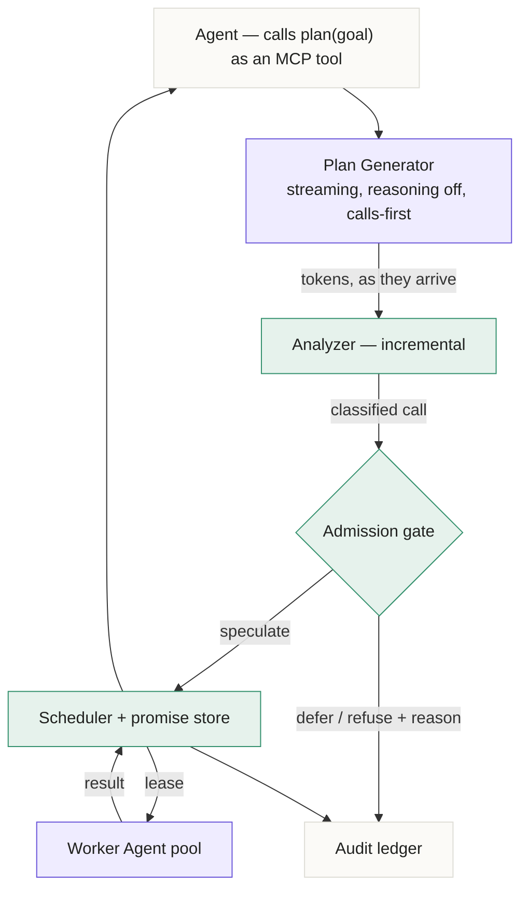
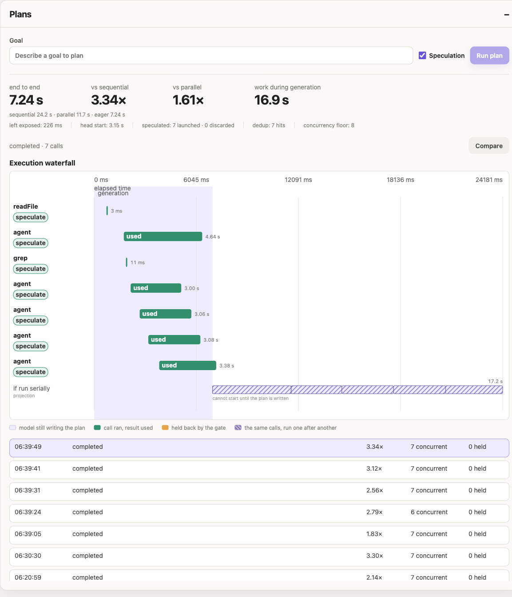
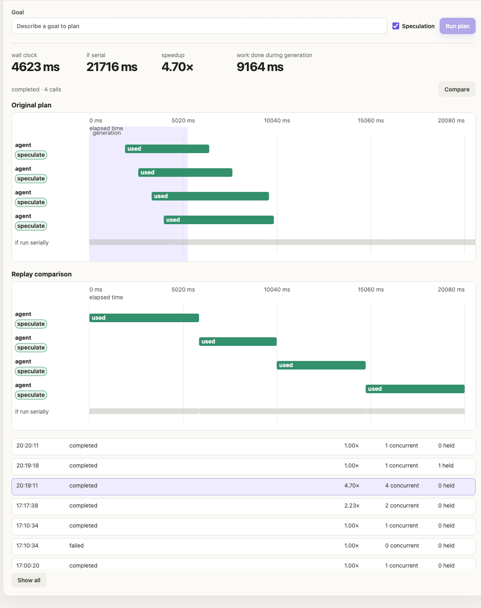
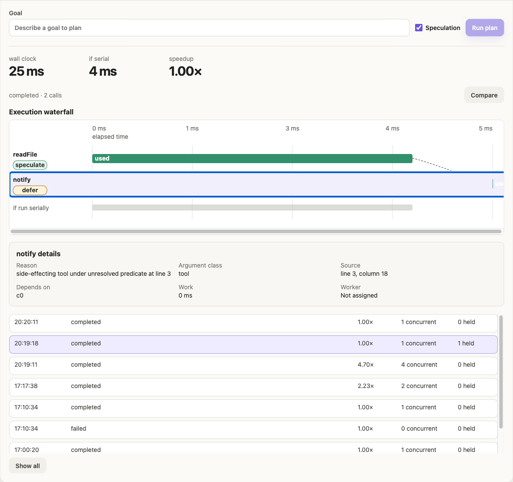

<h1 align="center">Eager Programmatic Tool Calling</h1>

<p align="center">
  <strong>Agents write a program that calls tools. This runs those calls before the program
  finishes being written — and decides which ones are safe to start early.</strong>
</p>

<p align="center">
  
  
  
  
  
</p>

---

**Track 1 — Agent Launchpad.** The middleware capability built here is a coordination and
reliability layer: it decides which of an agent's tool calls are safe to start before the plan
that calls them has finished being written, runs those, and refuses the ones it cannot account
for. It sits in the control plane and the Runtime path, between the agent and its tools, and
every decision it makes is recorded with a reason and the line of source that caused it.

## The problem

An agent doing real work makes several tool calls. Today they run one after another, even
when nothing connects them — because the program that calls them does not start until the
model has finished writing all of it, and then the calls fire in the order they were typed.

On this platform a single tool call is an entire agent turn. **I measured it at 66 seconds.**
So a six-call plan takes about seven and a half minutes, and almost all of that is the
platform sitting still, waiting on work it already had everything it needed to start.

Two different kinds of waiting, and this layer removes both.

## How it works



<sub>**Indigo is generation. Green is executed work.** These are the app's own colours — in the
waterfall, indigo is the band where the model is still writing and green is a call that ran.
Everything green is deterministic code; the model writes the plan and never decides what is
safe to start early.</sub>

### The one rule the whole design rests on

> **The model writes the plan. Nothing the model writes decides what is safe to run early.**

The analyzer, the admission gate and the scheduler are pure functions over a parsed program.
They are unit-testable without a model, they give the same answer every time, and a plan that
tries to talk its way past them has nothing to talk to.

That is also what makes the central guarantee testable: **the result must be identical whether
speculation is on or off.** A corpus of thirteen plans is executed serially, concurrently, and
speculatively — including under 30% injected provider faults — and the ordered results must
match exactly or the build fails.

## What it decides, per call

The analyzer classifies every argument and takes the worst class. Unknown means tainted.

| Decision | When | What happens |
|---|---|---|
| **speculate** | arguments are literal, purely computable, or resolved from an earlier call | Started as soon as its inputs exist — possibly while the model is still writing |
| **defer** | the tool has side effects, or sits under a predicate that cannot be resolved | Runs only when execution actually reaches it |
| **refuse** | an argument depends on something untrusted — `process`, `Math.random`, `Date.now`, filesystem reads, or any identifier that cannot be classified | Never speculated. **Still executes**, in order. Refusal governs *earliness*, never whether a call runs |

Taint is transitive. `writeFile` and `notify` are never speculated regardless of their
arguments, because you cannot un-write a file or un-send a message if the branch turns out not
to be taken.

## See it

<p align="center">
  
</p>

<p align="center"><b>Seven calls across three tools, every one of them started before the plan finished being written.</b><br>
<sub>The indigo band is the model still generating; every bar begins inside it. The hatched strip is
a projection, not measured work: the same calls laid end to end, starting where generation ends
because without speculation nothing can run until the plan exists.
<b>7.24 s end to end against 24.2 s sequential and 11.7 s parallel, with 16.9 s of tool work executed during generation.</b></sub></p>

<table>
<tr>
<td width="50%"></td>
<td width="50%"></td>
</tr>
<tr>
<td><b>Compare replays the plan for real.</b> The hatched strip is arithmetic; this is a measured
serial run on the same axis. Above, everything overlapping. Below, the same calls as a staircase. The two serial figures differ because an agent turn is not
deterministic in effort, which is exactly why the measured run is worth having.</td>
<td><b>A held call names its reason and its line.</b> <code>notify</code> is registered as
non-speculatable, so the gate refuses to start it early and says so, with the argument class, the
source position and <code>Worker: Not assigned</code>. It still runs when execution reaches it.
Refusal governs earliness, not whether a call happens.</td>
</tr>
</table>

## Where the speedup comes from

Two independent mechanisms, measured separately because they answer different questions.

| | Mechanism | Preconditions |
|---|---|---|
| **Execution overlap** | Independent calls run concurrently even though the program wrote them sequentially | None |
| **Generation overlap** | Calls start while the model is still writing the rest of the plan | The generation contract below |

**The generation contract.** The eager window is the time between the last call becoming
parseable and generation finishing. Two changes create it:

- `thinking: {"type": "disabled"}` for the planner. Writing six structured tool calls is
  decomposition, not reasoning. Measured: first code token **26.9 s → 0.43 s**, output tokens
  **2248 → 338**, and protocol adherence went from 0/3 valid calls to 3/3. Reasoning stays on
  in the sub-agents, where the actual work happens.
- **Calls before prose.** The model emits `PLAN_BEGIN`, the calls, `PLAN_END`, and only then
  its rationale — which is written while the calls are already executing.

Together these took the usable window from **0.46 s to 8.82 s**.

## Measured results

Three plan shapes, five repetitions each, n=15, against a live model. Times are end to end,
from the request arriving to the last call finishing.

| shape | sequential | parallel | eager | vs sequential | vs parallel |
|---|---|---|---|---|---|
| mixed (readFile + grep + 4 agents) | 26.0 s | 17.0 s | **12.0 s** | 2.19× | 1.40× |
| fan-out (4 independent agents) | 17.5 s | 8.6 s | **6.9 s** | 2.67× | 1.25× |
| chain (3 dependent calls) | 6.3 s | 6.3 s | **4.9 s** | 1.28× | 1.28× |
| **median, all 15 runs** | | | | **2.19×** | **1.30×** |

Ranges across the fifteen runs: 1.09–3.78× against sequential, 1.09–1.48× against parallel.
Median non-overlapped execution latency — the work left exposed after generation ends — is
**2,979 ms**.

**Why two baselines.** *Sequential* is generation plus the sum of every call. *Parallel* is
generation plus the longest call: tools concurrent with each other, but only starting once the
model has stopped writing. Parallel is the honest comparison, because modern agent runtimes
already dispatch a turn's tool calls concurrently. Eager is what this layer adds on top, by
overlapping tools with the generation itself.

That framing, and the `max(stream, max(tool))` model behind it, is the same one used by
[CloudThinker's open eager-tools benchmark](https://github.com/cloudthinker-ai/eager-tools),
which reports 1.20–1.50× against parallel across sixteen synthetic workloads, median 1.28×.
The 1.30× median here is measured on real agent turns rather than a paced synthetic stream.

**The shape that earns its place is the chain.** Three dependent calls, where concurrency can
contribute nothing at all — sequential and parallel are within five milliseconds of each other —
and the layer still returns 1.28×, entirely from starting the first call before the plan was
finished being written.

**What is deliberately not the headline.** An earlier version of this project divided the sum of
call durations by the execution phase that follows generation. That denominator collapses when
the calls finish inside the generation window, and on one unchanged goal it produced numbers from
2.28× to 1118×. It measured whether the slowest call happened to overrun generation. The
execution left exposed is now reported as a duration, where near-zero is the result rather than a
divisor.

## Run it

Requires **Node 22+**, **Docker** (or Colima/Podman), and a **BytePlus ModelArk** API key.

```bash
npm install
export ARK_API_KEY=<your ap-southeast Ark model key>
export ARK_MODEL=dola-seed-2-1-turbo-260628
export ARK_BASE_URL=https://ark.ap-southeast.bytepluses.com/api/v3
npm run poc
```

Then open **http://127.0.0.1:3000**, create an Agent, and expand **Plans** below the
Playground.

> **Two things that will cost you an hour otherwise.**
> Nothing in this repository reads `.env` — there is no dotenv and no `--env-file`, so the
> variables must be exported into the real environment. And `ARK_BASE_URL` must be the
> **international** BytePlus endpoint above; the starter kit ships the China-domestic
> Volcengine URL, which will not authenticate with a BytePlus key. API keys are region-scoped.

If port 3000 is taken, `PORT=3100 PUBLIC_PORT=3100 npm run poc`.

```bash
npm run check     # typecheck + 122 tests + both production builds
```

## Demo steps

1. Create an Agent from the sidebar and send it a task in the Playground — the baseline platform
   is unchanged. Ask it to write a `notes.txt` containing a few `TODO:` lines and a `Deadline:`
   line; the file tools read from the selected Agent's workspace, so the plans below need it.
2. Expand **Plans** and run, with **Speculation** ticked:

   > Read notes.txt and summarise it. Separately, search notes.txt for TODO. Separately, ask four
   > sub-agents to each define one term in a single short sentence: vector database, agent memory,
   > tool routing, prompt caching.

   Bounding each sub-agent to one sentence matters. `agent()` is a full Codex turn, so an
   open-ended prompt gives 60–90 s per call and the generation band shrinks to a sliver of the
   chart. Run it twice; the first turn on each worker pays container startup.
3. The waterfall shows every call beginning **inside the indigo generation band** — work running
   before the model had finished writing the plan — with each call's duration beside its bar.
4. Press **Compare** to replay the same plan serially and draw both on one axis. This re-executes
   for real, so it takes about as long as the `if serial` figure on screen.
5. For the denial case, run *"Read notes.txt, and if it mentions a deadline, notify the team on the
   releases channel about it."* `notify` is registered non-speculatable, so the gate marks it
   `defer`, names its reason and source position, and the notify log stays empty. It still runs
   when execution reaches it.
6. The plan list, decision reasons and per-call provenance remain inspectable throughout.

## Limitations

- **The generation contract is a precondition for the speculative half only.** The scheduler
  needs nothing and carries the larger share of the speedup. Present in that order.
- `speedup` is `serialMs / wallClockMs` and measures **execution-phase** concurrency only. On a
  strict dependency chain the generation saving is real and this metric still reads 1.00×.
  Report it alongside `generationOverlapMs`, never merged into it.
- **The plan language is a restricted subset.** Arbitrary JavaScript is refused, not executed.
- **Speculation wastes work** when a plan is revised mid-generation. Discarded speculations are
  counted and displayed rather than hidden.
- **Adaptive concurrency has never fired in production.** Halve-on-throttle with additive
  recovery is unit-tested against injected faults; no real provider throttle occurred during
  measurement.
- Five plan shapes, one model, one provider. *"Median 3.3× on this workload"* is supported.
  *"eager PTC gives 3.3×"* is not.

## Layout

```
apps/server/src/eptc/
  tools.ts            registry; speculatable / sideEffectFree / deterministic
  builtin-tools.ts    agent, readFile, grep, writeFile, notify
  analyzer.ts         parse, classify, taint, loop unrolling, admission
  plan-generator.ts   streaming generation, incremental speculation, phantom discard
  ark-stream.ts       SSE client for the Responses API
  plan-service.ts     scheduler, barriers, adaptive concurrency, audit
  promise-store.ts    claim-or-run, keyed (tool, argsHash, occurrence)
  worker-pool.ts      leases over platform Agents
  retry.ts            error classification for backoff
  redact.ts           secret redaction before persistence
  mcp.ts              MCP server exposing plan() as a native tool
apps/web/src/eptc/    waterfall panel and layout maths
docs/ARCHITECTURE-EPTC.md   the one-page architecture, trust boundary, and data flow
```

## Built on

The TikTok TechJam **Agent Launchpad** starter kit. Agent CRUD, lifecycle, Playground,
persistence and Codex execution are the kit's and are unchanged; everything under
`apps/server/src/eptc/` and `apps/web/src/eptc/` is this project.

**Tools and services used:** TypeScript, Node 22, Fastify, React, Vite, Vitest, Zod, acorn,
Docker, the OpenAI Codex CLI as the Agent runtime, and BytePlus ModelArk (Responses API) as the
model provider.

## License

MIT — see [LICENSE](LICENSE).
