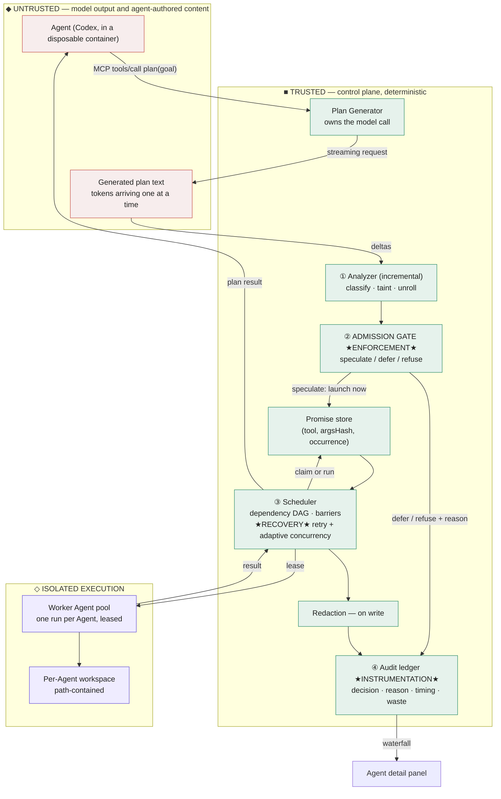

# Eager PTC — Architecture

One page. Middleware, data flow, trust boundary, and the enforcement, instrumentation and
recovery points.

Colours are the application's own: **red** is untrusted input, **green** is the deterministic
control plane, **indigo** is isolated execution — the same indigo the waterfall uses for the
window where the model is still generating.

## The trust boundary

**Everything the model produces is untrusted input.** The generated plan is parsed, never
`eval`'d; it is restricted to a small grammar, and any identifier the analyzer cannot classify
is tainted by default. A plan cannot reach a tool except through the admission gate, and the
gate is a pure function the plan has no way to address.

The boundary is crossed exactly twice: plan text flowing **in** to be analysed, and tool
results flowing **out** after redaction.

## The four labelled points

**① Instrumentation — incremental analyzer.** Re-parses the completed-lines region on every
delta and emits each call the moment its full expression and resolvable arguments arrive.
Records `argClass`, `dependsOn` and `sourceLoc` per call.

**② Enforcement — admission gate.** Decides `speculate` / `defer` / `refuse` per call, with a
required reason naming the offending identifier and line. Side-effecting tools are never
speculated. A refused call still executes in order — refusal governs earliness, not execution.

**③ Recovery — scheduler.** Errors are classified `throttle` / `transient` / `permanent`.
Throttles and transients retry with jittered exponential backoff, capped at 30 s; permanent
errors fail immediately. On a throttle the live concurrency limit **halves**, floor 1, and
recovers additively after a quiet window. In-flight calls are never cancelled. Worker leases
are released during backoff. A speculation that exhausts retries becomes a discarded
speculation and is re-executed inline — never a failed plan.

**④ Instrumentation — audit ledger.** Every call records its decision, reason, dependency set,
`workMs`, `retryWaitMs`, `speculatedAtMs`, `claimedAt`, worker identity and outcome. Plan
totals separate `executionOverlapMs` from `generationOverlapMs` and count
`speculationsDiscarded` — the waste is displayed, not hidden.

## What happens when it fails

Every failure path degrades to running the tool normally. A speculation failure may cost time;
it may never change a result or fail a run that would otherwise have succeeded.

| Failure | Behaviour |
|---|---|
| Generation unparseable | Retry once with the errors fed back, then a `failed` plan carrying them |
| Plan analyses to zero calls | `failed` — *"plan contained no executable tool calls"* |
| Speculation is a phantom after revision | Aborted, removed from the store, counted as discarded |
| Provider throttles | Backoff, concurrency halves, plan finishes slower |
| Worker pool exhausted | Calls queue; degrades toward serial; never throws |
| Promise-store or gate error | Falls through to direct execution |
| Unidentified MCP caller | JSON-RPC error, never a default agent |

## Invariants, all enforced by tests

1. **Equivalence.** Ordered `(id, tool, outcome, result)` is identical across serial,
   concurrent and speculative execution, over a 13-plan corpus, including under 30% injected
   provider faults. The build fails if it regresses.
2. **Honest timing.** For any used, non-deduped call, `endedAt − startedAt` is within 50 ms of
   `workMs`; retry and backoff time is accounted separately in `retryWaitMs`.
3. **Containment.** Tool paths cannot escape their Agent's workspace — `../`, absolute paths
   and escaping symlinks are refused.
4. **Redaction on write.** Secrets are removed before persistence, not before display.
5. **Source order.** Call records are always in source order, never completion order.
